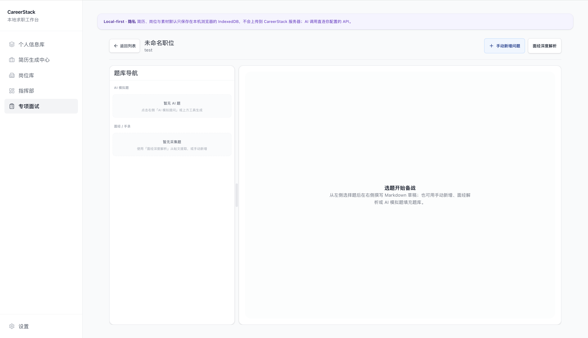
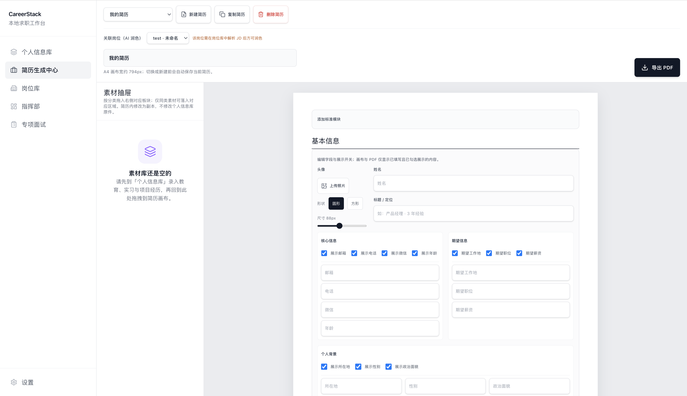
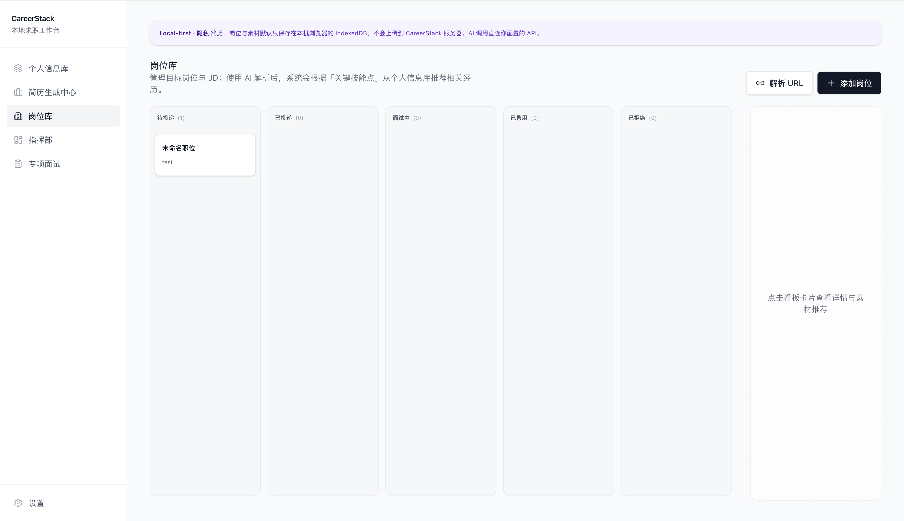

<div align="center">


# CareerStack

**本地优先的求职工作台** — 在浏览器里管理素材库、多版本简历、目标岗位 JD、面试题库与指挥部数据看板。

**在线体验：** [CareerStack（Vercel）](https://career-stack-lake.vercel.app/)

[](https://react.dev/)
[](https://vitejs.dev/)
[](https://tailwindcss.com/)
[](https://vercel.com/)

</div>

---

## 界面预览 (Screenshots)

> 以下为占位图：将实际截图放入 `docs/` 目录后即可在仓库中展示。

| 指挥部大屏看板 | AI 面试工作台 |
| :---: | :---: |
|  |  |

| 简历丝滑导出 | JD 智能解析 |
| :---: | :---: |
|  |  |

---

## 亮点

- **数据隐私 (Local-first)**：简历、岗位、经历等核心数据默认只存在本机 **IndexedDB**，不经 CareerStack 自有服务器；求职素材由你本地掌控。可选登录 Supabase 做云端备份。

- **AI 全流程**：通过你配置的 **OpenAI 兼容接口**（如 DeepSeek）直连调用 —— JD **结构化解析**、经历 **STAR 润色**、**分阶段全流程模拟面试**（一面 / 二面 / HR / 自定义）与面经抽取等；**支持在「设置 → Prompt 管理」中按场景自定义系统提示词**，未配置时自动使用内置默认提示词。

- **离线工作台（PWA）**：安装为应用后，静态资源由 Service Worker 预缓存；断网仍可浏览已保存内容（AI 等需联网功能除外）。

- **专业级 PDF 导出**：基于 `html-to-image` 与 **jsPDF**，将 A4 画布栅格为 PNG 再写入 PDF；导出前自动进入 `resume-export-mode`，隐藏拖拽、源码编辑区、「预览」标签等 UI，**成品 PDF 不含编辑态干扰元素**。

- **数据迁移**：侧栏「设置」支持 **IndexedDB 全量导出 / 导入 JSON**（含附件与头像 Base64、指挥部日历待办等；备份格式 v2，兼容 v1 导入）。

- **多维度题库管理体系**：面试题在保留 AI 题型标签的同时，增加 **备战分类**（通用 / 业务 / 技术 / 行为），支持筛选与色标区分；可与题型独立配置。

- **分阶段可视化任务流**：在面试工作台用 **@dnd-kit** 将题目从题库导航拖入 **当前阶段题库**；关联关系以 `job.interviewStageBuckets` 持久化（按 `round1` / `round2` / `hr` / `custom` 存储题目 id 列表），侧栏支持收起/展开并写入 localStorage。

- **面经驱动的交叉面试模型**：当岗位题库中存在 **面经 / 手录**（`USER_COLLECTED`）题目时，「开始模拟」会合并其当前文案与 **面试阶段侧重、JD、简历** 一并送入模型；在 `threeQuestionsDivergent` 系统提示下禁止复述原题，引导考点与简历/JD 的交叉追问与场景变形（temperature 约 0.7），生成题目标记为 `AI_FACE_DIVERGENT`（界面显示「基于面经发散」），便于应对大厂高频考点的变种提问。

---

## 技术架构（简述）

| 层级 | 技术 |
|------|------|
| 前端框架 | React 19、Vite 8、React Router 7 |
| 本地数据 | Dexie (IndexedDB) |
| 样式 | Tailwind CSS 4、@tailwindcss/typography |
| 图表 / 日历 | Recharts、react-calendar |
| PWA | vite-plugin-pwa |
| 可选云端 | Supabase Auth + `user_backups`（RLS），与本地 JSON 备份互补 |
| AI 调用 | 浏览器直连 OpenAI 兼容 Chat Completions；提示词来自 `aiPrompts.js` 默认值 + localStorage 覆盖。**专项面试**在 `interviewStagePrompts.js` 中按当前阶段（`round1` / `round2` / `hr` / `custom`）组装系统提示，调用 `generateThreeTargetedInterviewQuestions(..., { systemPrompt })`；user 消息仍为 JD JSON 与经历摘要。自定义阶段的主体文案对应 Prompt 项 `interviewCustom`，可与设置页双向编辑。 |
| 面试题库 UI | `@dnd-kit/core`：`useDraggable`（`nav-q-{questionId}`）与 `useDroppable`（`stage-drop-{stageId}`）完成拖放；落盘后更新岗位的 `interviewStageBuckets` 与 `InterviewWorkspacePage` 内 `enrichJobForInterviewWorkspace` 归一化。题目备战维度字段为 `prepDimension`，定义见 `db.js` 中 `INTERVIEW_PREP_DIMENSIONS`。 |
| 面经发散出题 | `generateThreeTargetedInterviewQuestions`：若 `faceExpReference`（由当前岗位全部 `USER_COLLECTED` 题目正文拼接）非空，则 user 消息按「面经基准 → `getInterviewStageFocusForUserContext` → JD → 简历」分节；system 使用 `threeQuestionsDivergent` + `INTERVIEW_OUTPUT_CONTRACT_DIVERGENT`；否则沿用原分阶段 `systemPrompt` 与标准 user 体。 |

**操作流程概要**：配置 API 与（可选）自定义 Prompt → 在个人信息库沉淀素材 → 岗位库解析 JD 与匹配分析 → 简历中心编排并导出 PDF → **分阶段专项面试**备战与复盘（按岗位进入工作台，选择轮次后生成模拟题）。

---

## 技术栈

React 19 · Vite 8 · React Router 7 · Dexie (IndexedDB) · Tailwind CSS 4 · Recharts · react-calendar · vite-plugin-pwa

## 本地运行

```bash
npm install
npm run dev
```

（仓库含 `.npmrc` 启用 `legacy-peer-deps`，以兼容 `vite-plugin-pwa` 与 Vite 8 的 peer 声明差异。）

浏览器打开终端提示的本地地址（默认 `http://localhost:5173`）。

```bash
npm run build
npm run preview
```

构建产物在 `dist/`，可用于任意静态托管（如 Vercel、Netlify、对象存储 + CDN）。

### 环境变量（可选）

复制 `.env.example` 为 `.env` 或 `.env.local`，按需填写。**不要**把含真实 API Key 的 `.env` 提交到公开仓库。

| 变量 | 说明 |
|------|------|
| `VITE_DEEPSEEK_API_KEY` | 构建时注入的默认 API Key（仍可在应用内「设置」覆盖） |
| `VITE_AI_BASE_URL` | 默认 OpenAI 兼容 Base URL |
| `VITE_AI_MODEL` | 默认模型名 |
| `VITE_SUPABASE_URL` / `VITE_SUPABASE_ANON_KEY` | 可选，用于登录与云端备份 |

> 说明：所有 `VITE_*` 会编译进前端包，仅适合私有构建或团队内部部署流水线。

## 安全与数据

- 代码库中**不应**硬编码任何 API Key；密钥来自本机 localStorage 或上述环境变量。
- AI 请求由浏览器直连第三方；除你配置的云端备份外，业务数据默认不离开本机。
- 更换浏览器前请使用「设置 → 导出备份」保存 JSON，并在新环境「导入备份」。

## PWA 与图标

首次构建前可执行 `node scripts/generate-pwa-icons.mjs` 生成 `public/pwa-192.png` 与 `public/pwa-512.png`（亦已纳入仓库）。生产构建会注册 Service Worker 并生成 Web App Manifest。

## 部署（Vercel）

仓库根目录已包含 `vercel.json`，将 SPA 路由回退到 `index.html`。将项目连接 Vercel 后，构建命令 `npm run build`，输出目录 `dist`。

## Chrome 扩展（可选）

`extension/` 目录为 Boss 直聘页一键采集 JD 的雏形，详见其中 `README.md`。

---

## 问题反馈

如有缺陷报告或功能建议，请填写飞书表单：  
[问题与建议反馈](https://xcnlrv02xcir.feishu.cn/share/base/form/shrcnWGXuESqLkSs72rhyiSKCEk)

应用内 **使用说明** 浮窗中亦提供同一链接。

## 许可证

私有项目按仓库约定使用。
